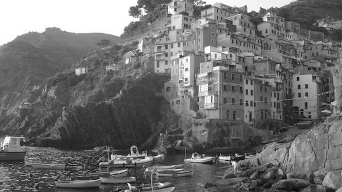

# CUDA-Parallel-Computation
Udacity CS344 :Introduction to Parallel Computing

Implementing parallel algorithms using Nvidia CUDA for the following image processing.
____________________

### 1) [Converting Colored Image to Black & White](Problem%20Set%201)

| Input | Output |
|-------|--------|
|||
____________________
### 2) [Applying Gaussian Blur to an Image](Problem%20Set%202)

| Input | Output |
|-------|--------|
|||
____________________
### 3) [High Dynamic Range(HDR) Image](Problem%20Set%203)

**Background Chrominance-Luminance**

| Input | Output |
|-------|--------|
|||
____________________

## Project Author
#### Roopansh Bansal

B.Tech undergraduate (Computer Science & Engineering)

Indian Institute of Technology Guwahati

India

[E-Mail](mailto:roopansh.bansal@gmail.com)  |  [LinkedIn](https://www.linkedin.com/in/roopansh-bansal)
